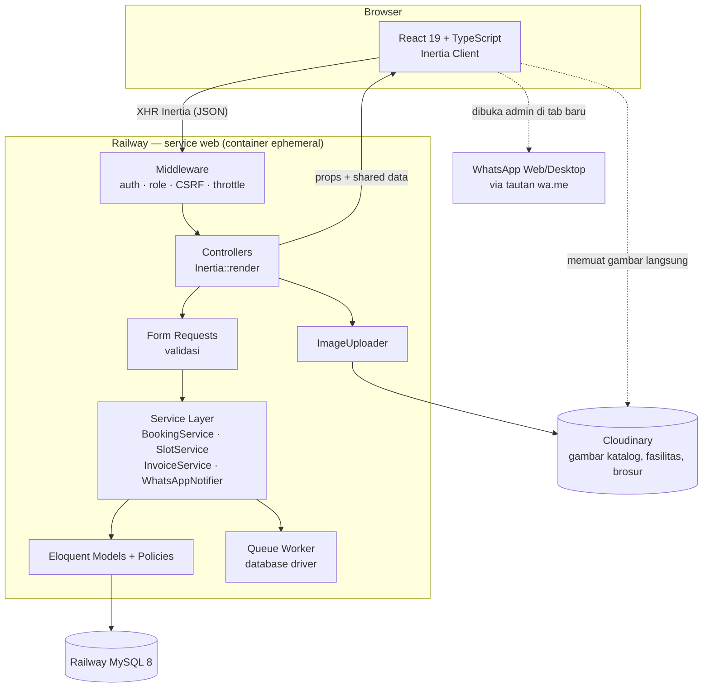

# 03 — Arsitektur Teknis

## 3.1 Tumpukan Teknologi

Basis proyek memakai **`laravel/react-starter-kit`** (bukan Breeze), karena kit tersebut sudah
membawa Inertia 2 + React 19 + TypeScript + Tailwind 4 + shadcn/ui — persis kombinasi yang
dirancang di sini. Breeze masih memakai Tailwind 3.

| Lapis | Pilihan | Versi terpasang | Alasan |
|-------|---------|-----------------|--------|
| Bahasa server | PHP | **8.2** (XAMPP) | Laravel 12 mensyaratkan ≥ 8.2 |
| Framework | Laravel | 12.64 | Diminta; ekosistem lengkap (queue, policy, validation) |
| Jembatan UI | Inertia.js | 2.x | Keputusan #1 — React tanpa membangun API terpisah |
| UI | React | 19 | Diminta |
| Bahasa UI | TypeScript | 5.7 | Kontrak props Inertia terjamin saat compile |
| Bundler | Vite | 6.x | Bawaan Laravel 12 |
| CSS | Tailwind CSS | 4.x | Konsisten dengan design token, tanpa CSS global yang saling menimpa |
| Komponen | shadcn/ui (Radix UI) | terbaru | Komponen tak-berpendapat, aksesibel, kodenya masuk repo (bukan dependensi kaku) |
| Ikon | lucide-react | terbaru | Menggantikan Font Awesome CDN |
| Font | @fontsource/inter | terbaru | Inter di-*self-host*, tanpa CDN (kebijakan CSP §9.5) |
| Toast | sonner | terbaru | Menggantikan `alert()` sistem lama |
| Grafik | Recharts | 2.x | Grafik tren dashboard (dipasang di Fase 4) |
| Database | **MySQL 8 di Railway** | — | Satu instans dipakai bersama development & deployment sampai F2.5.1. MariaDB 10.4 (XAMPP) dipertahankan **hanya** untuk menguji `migrate`/`rollback` |
| Penyimpanan berkas | **Cloudinary** (`cloudinary/cloudinary_php`) | 2.x | Filesystem Railway ephemeral — berkas di disk hilang tiap redeploy. Transformasi URL menggantikan pemrosesan gambar dengan GD |
| Hosting | **Railway**, auto-deploy dari GitHub | — | Menggantikan rencana VPS. Rincian: [12-panduan-instalasi-deploy.md](12-panduan-instalasi-deploy.md) |
| Autentikasi | `laravel/react-starter-kit` | — | Register/login/reset bawaan yang sudah teruji |
| Otorisasi | Policy + Gate + enum `UserRole` | — | Keputusan #8 |
| Export | `maatwebsite/excel` | 3.x | Menggantikan SheetJS di klien (temuan S7) |
| PDF | `barryvdh/laravel-dompdf` | 3.x | Invoice PDF |
| Audit | `spatie/laravel-activitylog` | 4.x | Temuan D5 |
| Testing | Pest | 3.x | Uji fitur & unit |
| Queue | driver `database` | — | Pembuatan PDF & pekerjaan ringan lain |

### Yang sengaja tidak dipakai

- **Firebase** — dihapus total sesuai instruksi.
- **Laravel Sanctum / Passport** — tidak ada API publik; Inertia memakai session + cookie CSRF.
- **Redis** — beban sistem tidak menuntutnya; cache `file`, queue `database`.
- **Spatie Permission** — hanya 3 role; enum + Policy sudah cukup dan lebih ringan dibaca.

## 3.2 Diagram Arsitektur



**Yang perlu digarisbawahi:** browser **tidak pernah** menyentuh database. Ini menutup temuan
S4 dan S8 sistem lama sekaligus.

## 3.3 Pola Inertia

### Alur request

1. Kunjungan pertama → Laravel mengembalikan HTML lengkap berisi `data-page` (props JSON).
2. Navigasi berikutnya → Inertia mengirim XHR dengan header `X-Inertia`, server membalas JSON props saja.
3. React menukar komponen halaman tanpa reload penuh.

### Aturan props

- Controller **hanya** mengirim data yang dipakai layar tersebut, lewat **API Resource**
  (`BookingResource`, `VehicleResource`) — jangan pernah mengirim model mentah.
- Data yang mahal dibungkus `Inertia::lazy()` agar tidak ikut terkirim saat partial reload.
- Setiap halaman punya tipe props di `resources/js/types/` — halaman tanpa tipe ditolak saat review.

### Shared data (`HandleInertiaRequests`)

```php
'auth'  => ['user' => $request->user() ? new UserResource($request->user()) : null],
'flash' => ['success' => fn () => $request->session()->get('success'),
            'error'   => fn () => $request->session()->get('error')],
'company' => fn () => config('company'),   // alamat, telepon, jam operasional
'unread'  => fn () => $request->user()?->isStaff() ? ContactMessage::unread()->count() : null,
```

## 3.4 Endpoint JSON Internal

Meski memakai Inertia, tiga kebutuhan tetap butuh JSON murni. Semuanya berada di
`routes/web.php` (bukan `api.php`) agar tetap memakai session — **bukan** API publik:

| Method | URI | Guna | Akses |
|--------|-----|------|-------|
| GET | `/booking/slots?date=YYYY-MM-DD` | Ketersediaan & sisa kuota tiap slot untuk kalender booking | publik, throttle 60/menit |
| GET | `/admin/dashboard/chart?range=30` | Data grafik tren | staf |
| POST | `/admin/bookings/{booking}/whatsapp/mark-sent` | Menandai draft WA sudah dikirim | staf |

## 3.5 Struktur Rute

```
routes/web.php
├── Publik
│   ├── GET  /                       HomeController@index
│   ├── GET  /katalog                CatalogController@index
│   ├── GET  /katalog/{slug}         CatalogController@show
│   ├── GET  /layanan                ServicePackageController@publicIndex
│   ├── GET  /fasilitas              FacilityController@index
│   ├── GET  /tentang                PageController@about
│   ├── GET  /kontak                 ContactController@create
│   ├── POST /kontak                 ContactController@store        (throttle:5,1)
│   ├── GET  /cek-service            PublicTrackingController@index (lacak pakai kode booking)
│   └── GET  /faq                    PageController@faq
│
├── Tamu (guest)
│   ├── GET|POST /register, /login, /forgot-password, /reset-password   (Breeze)
│
├── Customer (auth + verified? tidak — lihat catatan)
│   ├── GET  /dashboard              Customer\DashboardController
│   ├── resource /kendaraan          Customer\VehicleController
│   ├── GET  /booking                Customer\BookingController@create
│   ├── POST /booking                Customer\BookingController@store
│   ├── GET  /booking/{booking}      Customer\BookingController@show      (Policy: milik sendiri)
│   ├── PUT  /booking/{booking}/jadwal-ulang  Customer\BookingController@reschedule
│   ├── PUT  /booking/{booking}/batal          Customer\BookingController@cancel
│   ├── GET  /riwayat                Customer\HistoryController@index
│   ├── GET  /invoice/{invoice}      Customer\InvoiceController@show
│   ├── GET  /invoice/{invoice}/pdf  Customer\InvoiceController@download
│   └── GET|PUT /profil              Customer\ProfileController
│
└── Admin (auth + role:super_admin|service_advisor) prefix /admin
    ├── GET  /                       Admin\DashboardController
    ├── GET  /jadwal                 Admin\ScheduleController          (okupansi slot harian)
    ├── resource /bookings           Admin\BookingController
    ├── PUT  /bookings/{b}/status    Admin\BookingStatusController@update
    ├── resource /customers          Admin\CustomerController          (index/show saja)
    ├── resource /vehicles           Admin\VehicleController
    ├── resource /invoices           Admin\InvoiceController
    ├── GET  /laporan                Admin\ReportController@index
    ├── GET  /laporan/export         Admin\ReportController@export
    └── super_admin saja:
        ├── resource /katalog        Admin\CarModelController (+ varian, +galeri)
        ├── resource /paket-layanan  Admin\ServicePackageController
        ├── resource /fasilitas      Admin\FacilityController
        ├── resource /faq            Admin\FaqController
        ├── resource /testimoni      Admin\TestimonialController
        ├── resource /users          Admin\UserController
        ├── resource /wa-template    Admin\WhatsAppTemplateController
        ├── GET  /pesan-masuk        Admin\ContactMessageController
        └── GET  /activity-log       Admin\ActivityLogController
```

**Catatan verifikasi:** karena keputusan #4 meniadakan email notifikasi, `MustVerifyEmail`
**tidak** dipakai. Perlindungan terhadap akun sampah dialihkan ke rate limit registrasi
(`throttle:5,60` per IP) dan kemampuan admin menonaktifkan akun.

## 3.6 Lapis Service

Logika bisnis **tidak** tinggal di controller. Empat service inti:

| Service | Tanggung jawab |
|---------|----------------|
| `SlotService` | Menghasilkan daftar slot suatu tanggal, menghitung sisa kuota, memvalidasi H-1 & hari tutup. Satu-satunya tempat aturan slot hidup. |
| `BookingService` | Membuat, menjadwal ulang, membatalkan booking; menerbitkan kode booking; mencatat riwayat status. |
| `InvoiceService` | Menyusun rincian biaya, menghitung subtotal/diskon/total, menerbitkan nomor invoice. |
| `WhatsAppNotifier` | Interface. Implementasi `ClickToChatNotifier` merender template menjadi tautan `wa.me`. Implementasi gateway otomatis bisa ditambahkan tanpa mengubah pemanggil. |

## 3.7 Konfigurasi Kunci

**`config/booking.php`** — satu-satunya sumber kebenaran aturan slot (menutup temuan B2):

```php
return [
    'timezone'          => 'Asia/Jakarta',
    'lead_time_days'    => 1,                       // wajib H-1
    'max_advance_days'  => 60,                      // paling jauh 2 bulan ke depan
    'quota_per_slot'    => 2,                       // aturan lama: maks 2 booking per jam
    'closed_weekdays'   => [0],                     // 0 = Minggu
    'slots' => [
        '08:00', '08:30', '09:00', '09:30', '10:00', '10:30',
        '11:00', '11:30', '13:00', '13:30', '14:00',
    ],
    'reschedule_min_days_before' => 1,
];
```

**`config/company.php`** — profil perusahaan (dipakai landing page, footer, template WA, PDF invoice).
Isinya dikutip persis dari [01-analisis-sistem-lama.md §1.5](01-analisis-sistem-lama.md#15-informasi-perusahaan-dikutip-persis-tidak-boleh-diubah).

## 3.8 Berkas & Penyimpanan — Cloudinary

Filesystem container Railway bersifat **ephemeral**: apa pun yang ditulis ke disk hilang pada
redeploy berikutnya. Karena itu tidak ada `storage:link` dan tidak ada berkas unggahan di disk.

- Seluruh unggahan melalui `app/Services/ImageUploader.php` — pembungkus SDK
  `cloudinary/cloudinary_php`. **Tidak ada** pemanggilan SDK di controller atau model, sehingga
  ganti penyedia kelak hanya menyentuh satu berkas. `FakeImageUploader` dipakai di uji Pest agar
  pengujian tidak menembak jaringan.
- Folder Cloudinary: `car-models/{id}/`, `facilities/`, `testimonials/`, `brochures/`.
- Database menyimpan `*_public_id` (untuk hapus/ganti) **dan** `*_url` (agar render halaman tidak
  memanggil API) — bukan path. Lihat [12 §12.5](12-panduan-instalasi-deploy.md#125-menyiapkan-cloudinary).
- Validasi **tetap di server** dan tidak berubah: maks 2 MB, hanya `jpg|jpeg|png|webp`
  (brosur `pdf` maks 5 MB), diverifikasi lewat MIME sungguhan bukan ekstensi, nama berkas
  di-generate ulang. Cloudinary bukan pengganti validasi.
- Ukuran turunan tidak lagi dibuat di server. Transformasi dilakukan di URL:
  `f_auto,q_auto,w_400` (thumbnail) dan `f_auto,q_auto,w_1600` (penuh). Konsekuensinya
  ekstensi PHP `gd` **tidak dibutuhkan**.
- Migrasi awal: 9 gambar dari `raw.githubusercontent.com` (1 hero + 8 fasilitas) ada di repo
  `database/seeders/assets/`, diunggah ke Cloudinary oleh seeder.

## 3.9 Lingkungan & Deployment

Target deployment adalah **Railway dengan auto-deploy dari GitHub**, bukan VPS. Panduan langkah
demi langkah: [12-panduan-instalasi-deploy.md](12-panduan-instalasi-deploy.md).

| Lingkungan | Keterangan |
|------------|------------|
| Lokal | `php artisan serve` + `npm run dev`, **tersambung ke database Railway yang sama** dengan deployment |
| Railway | Service `web` (Laravel + Vite) + service MySQL; auto-deploy tiap push ke `main` |

**Rilis tidak dijalankan manual.** Push ke `main` memicu build Nixpacks
(`composer install` → `npm ci` → `npm run build`), lalu **pre-deploy command**
`php artisan migrate --force`, lalu start command yang menjalankan `config:cache`,
`route:cache`, `view:cache` sebelum menyalakan server pada `$PORT`.

Tiga hal yang khas Railway dan mudah terlewat:

1. **`trustProxies(at: '*')`** di `bootstrap/app.php` — tanpa ini Laravel membangun URL `http://`
   di balik proxy Railway sehingga aset Vite dan redirect rusak.
2. **`SESSION_DRIVER`, `CACHE_STORE`, `QUEUE_CONNECTION` wajib `database`**, bukan `file` —
   driver `file` di disk ephemeral membuat pengguna ter-logout acak setiap redeploy.
3. **`LOG_CHANNEL=stderr`** — `storage/logs` ikut hilang saat redeploy.

Variabel penting: `APP_KEY` (jangan digenerate ulang setelah ada data), `APP_TIMEZONE=Asia/Jakarta`,
`DB_*` (referensi `${{MySQL.*}}`), `CLOUDINARY_URL`, `COMPANY_WA_NUMBER=62xxxxxxxxxx`.

> **Selama Big Fase 1 hanya ada satu database**, dipakai development sekaligus deployment.
> Karena dikerjakan satu orang yang berpindah perangkat dan seluruh isinya berasal dari seeder,
> `migrate:fresh --seed` **diperbolehkan** — itu justru cara menyamakan kedua device. Batasnya
> ada di [12 §12.6](12-panduan-instalasi-deploy.md#126-database-bersama-satu-developer-dua-device).
> Database produksi dipisahkan di F2.5.1 sebelum go-live.

## 3.10 Kualitas & Otomasi

- **Backend:** Pest (uji fitur per alur bisnis), Laravel Pint (format PSR-12), PHPStan/Larastan level 5.
- **Frontend:** TypeScript `strict`, ESLint + Prettier, Vitest untuk util murni.
- **Wajib ada uji** untuk: aturan kuota slot, aturan H-1, larangan hari Minggu, otorisasi tiap role, dan kepemilikan booking (customer A tidak bisa membuka booking customer B).
