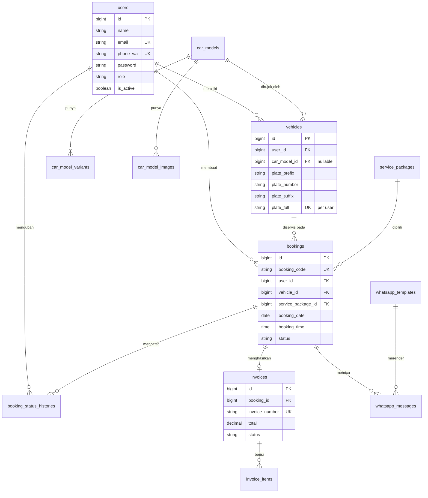

# 04 — Skema Database (MySQL 8)

Konvensi: nama tabel jamak snake_case · primary key `id` (BIGINT UNSIGNED AUTO_INCREMENT) ·
seluruh tabel punya `created_at`/`updated_at` · uang memakai `DECIMAL(12,2)` (bukan float) ·
enum ditulis sebagai kolom `VARCHAR` + PHP Enum, bukan tipe `ENUM` MySQL (agar penambahan nilai
tidak memerlukan `ALTER TABLE`) · `utf8mb4_unicode_ci`.

## 4.1 ERD



## 4.2 Definisi Tabel

### `users` — customer & staf internal dalam satu tabel

| Kolom | Tipe | Ket. |
|-------|------|------|
| id | bigint PK | |
| name | varchar(120) | |
| email | varchar(150) UNIQUE | identitas login (keputusan #5) |
| phone_wa | varchar(20) UNIQUE | disimpan ternormalisasi `62xxxxxxxxxx` |
| password | varchar(255) | bcrypt |
| role | varchar(20) | `super_admin` \| `service_advisor` \| `customer` — default `customer` |
| address | varchar(255) NULL | opsional, untuk invoice |
| is_active | boolean | default `true`; akun nonaktif tidak bisa login |
| last_login_at | timestamp NULL | |
| must_reset_password | boolean | default `false`; dipakai akun hasil import |
| remember_token, timestamps, deleted_at | | soft delete |

Index: `role`, `is_active`.

**Alasan satu tabel:** hanya 3 role dan tidak ada atribut khusus yang banyak berbeda; dua tabel
terpisah akan memaksa dua guard, dua alur reset password, dan mempersulit `handled_by` pada booking.

### `car_models` — katalog produk Chery (publik)

| Kolom | Tipe | Ket. |
|-------|------|------|
| id | bigint PK | |
| name | varchar(120) | mis. "Tiggo 8 Pro" |
| slug | varchar(140) UNIQUE | URL `/katalog/tiggo-8-pro` |
| category | varchar(30) | `suv` \| `sedan` \| `mpv` \| `ev` |
| fuel_type | varchar(20) | `ice` \| `hybrid` \| `ev` — memengaruhi paket maintenance yang relevan |
| series_code | varchar(40) NULL | `tiggo_5x_cross`, `tiggo_8`, `ev`, `csh` — dipetakan ke `service_packages.applicable_series` |
| price_start | decimal(12,2) NULL | harga mulai; null = "hubungi kami" |
| short_description | varchar(255) | untuk kartu katalog |
| description | text NULL | halaman detail |
| specs | json NULL | `{"mesin":"1.6 TGDI","transmisi":"7DCT","kapasitas":"7 penumpang"}` |
| brochure_path | varchar(255) NULL | PDF brosur |
| is_active, sort_order | | |
| timestamps | | |

### `car_model_variants`

| Kolom | Tipe | Ket. |
|-------|------|------|
| id, car_model_id FK cascade | | |
| name | varchar(80) | "Premium", "Luxury" |
| price | decimal(12,2) NULL | |
| specs | json NULL | selisih spesifikasi terhadap model dasar |
| is_active, sort_order, timestamps | | |

### `car_model_images`

| Kolom | Tipe | Ket. |
|-------|------|------|
| id, car_model_id FK cascade | | |
| path | varchar(255) | relatif terhadap disk `public` |
| alt | varchar(160) | wajib, untuk aksesibilitas & SEO |
| is_primary | boolean | satu per model |
| sort_order, timestamps | | |

### `vehicles` — unit milik customer

| Kolom | Tipe | Ket. |
|-------|------|------|
| id | bigint PK | |
| user_id | FK → users, cascade | |
| car_model_id | FK → car_models, nullable, `nullOnDelete` | null bila bukan Chery (lihat Q3) |
| model_name_manual | varchar(120) NULL | dipakai saat `car_model_id` null |
| plate_prefix | varchar(2) | **1–2 huruf** — memperbaiki temuan B1 |
| plate_number | varchar(4) | 1–4 angka |
| plate_suffix | varchar(3) | 1–3 huruf |
| plate_full | varchar(12) | hasil gabungan `B-1234-ABC`, di-generate model, **UNIQUE (user_id, plate_full)** |
| year | smallint NULL | |
| color | varchar(40) NULL | |
| vin | varchar(25) NULL | nomor rangka, untuk klaim garansi |
| last_odometer | int unsigned NULL | diperbarui saat servis selesai |
| is_primary | boolean | kendaraan utama customer |
| timestamps, deleted_at | | |

Index: `(user_id, is_primary)`, `plate_full`.

### `service_packages` — menggantikan dropdown hardcode

| Kolom | Tipe | Ket. |
|-------|------|------|
| id | bigint PK | |
| code | varchar(60) UNIQUE | mempertahankan kode lama: `first_maintenance_1000`, `Tiggo_8_Free`, `Other`, … |
| name | varchar(200) | |
| category | varchar(40) | `first_maintenance_ice` \| `first_maintenance_ev` \| `free_maintenance` \| `other` |
| description | text NULL | |
| applicable_series | json NULL | `["tiggo_8"]`; null = berlaku untuk semua |
| estimated_duration_minutes | smallint | default 60; dipakai untuk estimasi selesai |
| price | decimal(12,2) | 0 untuk paket gratis |
| is_free | boolean | tampil sebagai "Gratis" alih-alih Rp 0 |
| is_active, sort_order, timestamps | | |

### `bookings` — tabel inti

| Kolom | Tipe | Ket. |
|-------|------|------|
| id | bigint PK | |
| booking_code | varchar(20) UNIQUE | `CA-20260803-0001` (temuan D2) |
| user_id | FK → users, restrict | pemilik booking |
| vehicle_id | FK → vehicles, restrict | |
| service_package_id | FK → service_packages, restrict | |
| booking_date | date | |
| booking_time | time | salah satu nilai `config('booking.slots')` |
| status | varchar(20) | lihat state machine [05](05-alur-bisnis.md) — default `pending` |
| source | varchar(15) | `web` \| `walk_in` (dibuat admin) |
| odometer | int unsigned NULL | KM saat masuk |
| complaint | text NULL | "Keluhan" pada sistem lama |
| admin_note | text NULL | catatan internal, tidak terlihat customer |
| handled_by | FK → users, nullable | service advisor penanggung jawab |
| confirmed_at, started_at, completed_at, cancelled_at | timestamp NULL | |
| cancel_reason | varchar(255) NULL | wajib saat status `cancelled` |
| rescheduled_from_id | FK → bookings, nullable | jejak penjadwalan ulang |
| estimated_finish_at | datetime NULL | `booking_datetime + estimated_duration_minutes` |
| timestamps, deleted_at | | |

Index penting:
- `UNIQUE (booking_code)`
- `INDEX (booking_date, booking_time)` → dipakai `SlotService` menghitung kuota
- `INDEX (status, booking_date)` → daftar & filter admin
- `INDEX (user_id, booking_date)` → riwayat customer

**Aturan kuota** diberlakukan di dua lapis: `SlotService` (validasi + pesan ramah) **dan**
transaksi database dengan `SELECT … FOR UPDATE` saat menyimpan, agar dua permintaan bersamaan
tidak menembus kuota 2 (kelemahan nyata sistem lama yang memeriksa lalu menulis tanpa kunci).

### `booking_status_histories` — timeline & audit

| Kolom | Tipe | Ket. |
|-------|------|------|
| id, booking_id FK cascade | | |
| from_status, to_status | varchar(20) | `from_status` null saat booking dibuat |
| changed_by | FK → users, nullable | null bila dilakukan sistem |
| note | varchar(255) NULL | catatan yang **terlihat customer** |
| created_at | timestamp | tanpa `updated_at` — baris ini tidak pernah diubah |

Inilah sumber data timeline pada halaman tracking customer (US-C5).

### `invoices`

| Kolom | Tipe | Ket. |
|-------|------|------|
| id, booking_id FK unique | | satu booking maksimal satu invoice |
| invoice_number | varchar(25) UNIQUE | `INV/2026/08/0001` |
| subtotal, discount, tax, total | decimal(12,2) | `tax` default 0; PPN opsional |
| status | varchar(15) | `draft` \| `issued` \| `paid` \| `void` |
| issued_at, paid_at | timestamp NULL | |
| payment_method | varchar(30) NULL | `cash` \| `transfer` \| `edc` — pencatatan saja |
| notes | text NULL | |
| created_by | FK → users | |
| timestamps | | |

### `invoice_items`

| Kolom | Tipe | Ket. |
|-------|------|------|
| id, invoice_id FK cascade | | |
| type | varchar(10) | `jasa` \| `part` |
| description | varchar(200) | |
| qty | decimal(8,2) | mendukung 0,5 jam jasa |
| unit_price | decimal(12,2) | |
| subtotal | decimal(12,2) | `qty × unit_price`, dihitung server |
| sort_order, timestamps | | |

### `whatsapp_templates`

| Kolom | Tipe | Ket. |
|-------|------|------|
| id | | |
| key | varchar(50) UNIQUE | `booking_created`, `booking_confirmed`, `booking_in_progress`, `booking_completed`, `booking_cancelled`, `reminder_h1` |
| name | varchar(100) | label di panel admin |
| body | text | mengandung placeholder `{{nama}}`, `{{kode_booking}}`, `{{tanggal}}`, `{{jam}}`, `{{plat}}`, `{{paket}}`, `{{status}}` |
| is_active, timestamps | | |

### `whatsapp_messages` — log klik-to-chat

| Kolom | Tipe | Ket. |
|-------|------|------|
| id, booking_id FK cascade | | |
| template_key | varchar(50) | |
| recipient_phone | varchar(20) | nomor ternormalisasi saat pesan dibuat |
| rendered_message | text | isi final, disimpan agar bisa diaudit |
| generated_by | FK → users | admin yang membuka draft |
| status | varchar(15) | `generated` \| `sent` (ditandai manual) \| `skipped` |
| sent_at | timestamp NULL | |
| timestamps | | |

### `facilities` — 8 fasilitas, kini bisa dikelola admin

| Kolom | Tipe |
|-------|------|
| id, title (varchar 120), description (varchar 255), image_path (varchar 255), sort_order, is_active, timestamps |

### `faqs`

| Kolom | Tipe |
|-------|------|
| id, question (varchar 255), answer (text), category (varchar 40 NULL), sort_order, is_active, timestamps |

### `testimonials`

| Kolom | Tipe |
|-------|------|
| id, customer_name (varchar 120), car_model (varchar 120 NULL), rating (tinyint 1–5), content (text), is_published, sort_order, timestamps |

### `contact_messages`

| Kolom | Tipe | Ket. |
|-------|------|------|
| id, name, email, phone, subject, message | | dari form kontak publik |
| is_read | boolean | |
| read_by | FK → users, nullable | |
| ip_address | varchar(45) | untuk penanganan spam |
| timestamps | | |

### `activity_log`

Dibuat oleh `spatie/laravel-activitylog` (migration bawaan paket). Dicatat untuk model
`Booking`, `Invoice`, `User`, `CarModel`, `ServicePackage`.

## 4.3 Nilai Enum

```php
enum UserRole: string      { case SuperAdmin = 'super_admin';
                             case ServiceAdvisor = 'service_advisor';
                             case Customer = 'customer'; }

enum BookingStatus: string { case Pending    = 'pending';      // menunggu konfirmasi
                             case Confirmed  = 'confirmed';    // dikonfirmasi advisor
                             case InProgress = 'in_progress';  // sedang dikerjakan
                             case Completed  = 'completed';    // selesai
                             case Cancelled  = 'cancelled';    // dibatalkan
                             case NoShow     = 'no_show'; }    // tidak hadir

enum InvoiceStatus: string { case Draft = 'draft'; case Issued = 'issued';
                             case Paid = 'paid';   case Void = 'void'; }
```

Pemetaan dari status lama: `Successful → confirmed`, `Pending → pending`,
`In Progress → in_progress`, `Completed → completed`, `Cancelled → cancelled`.
Status `Successful` lama dihapus karena rancu — ia sebenarnya berarti "booking berhasil masuk",
bukan tahapan pekerjaan (temuan B10).

## 4.4 Rencana Seeder

| Seeder | Isi |
|--------|-----|
| `UserSeeder` | 1 Super Admin, 1 Service Advisor, 3 customer contoh (hanya di lokal) |
| `ServicePackageSeeder` | 10 paket dari sistem lama, lengkap dengan `code` asli |
| `CarModelSeeder` | Tiggo 5X, Tiggo Cross, Tiggo 7 Pro, Tiggo 8 Pro, Omoda 5, Omoda E5 (EV), Jaecoo J7 — beserta varian & 1 gambar |
| `FacilitySeeder` | 8 fasilitas + gambar dari `database/seeders/assets/` |
| `FaqSeeder` | 8 pertanyaan umum (syarat booking, H-1, garansi, gratis servis berkala, cara batal, dsb.) |
| `WhatsAppTemplateSeeder` | 6 template pesan |
| `TestimonialSeeder` | 4 testimoni contoh (hanya di lokal) |
| `DemoBookingSeeder` | 30 booking tersebar 14 hari untuk menguji dashboard (hanya di lokal) |

Perintah: `php artisan migrate:fresh --seed`. Seeder demo dilindungi `if (app()->isLocal())`.

## 4.5 Kebijakan Penghapusan

| Entitas | Perilaku |
|---------|----------|
| Booking | **Soft delete**; pembatalan memakai status `cancelled` + alasan, bukan hapus (temuan F12/D5) |
| User | Soft delete + `is_active=false`; data booking tetap utuh |
| Vehicle | Soft delete; booking lama tetap merujuk kendaraan yang sama |
| Car model | Tidak boleh dihapus bila masih dirujuk `vehicles`; cukup `is_active=false` |
| Service package | Sama seperti di atas — nonaktifkan, jangan hapus |
| Invoice | Tidak pernah dihapus; dibatalkan lewat status `void` |
