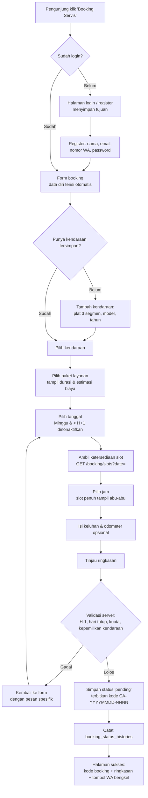
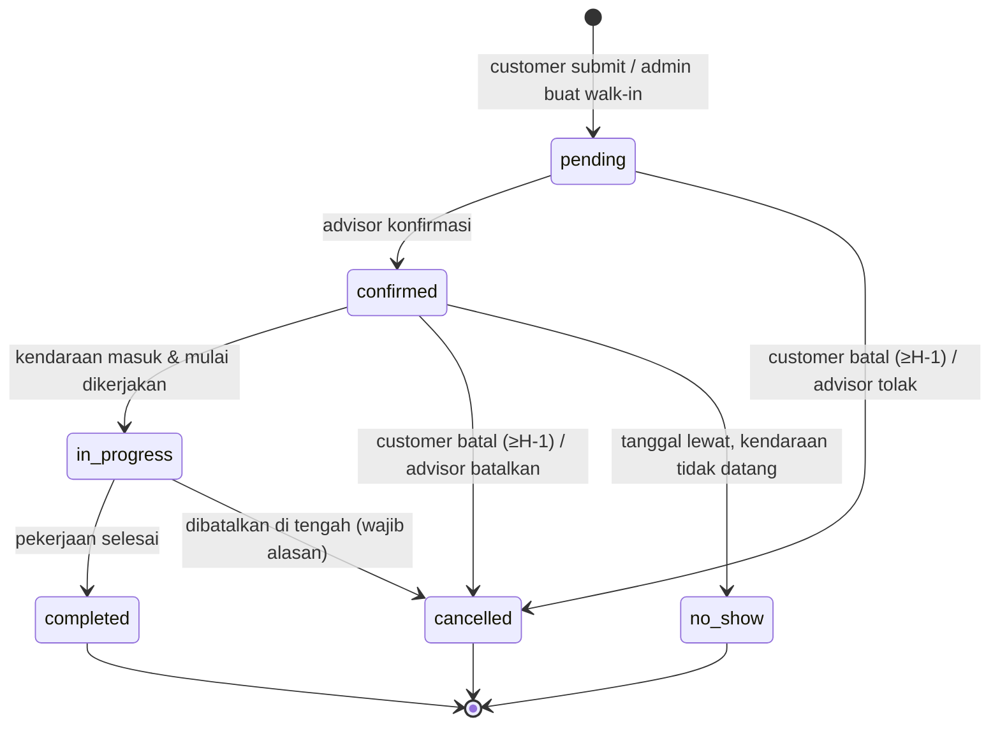
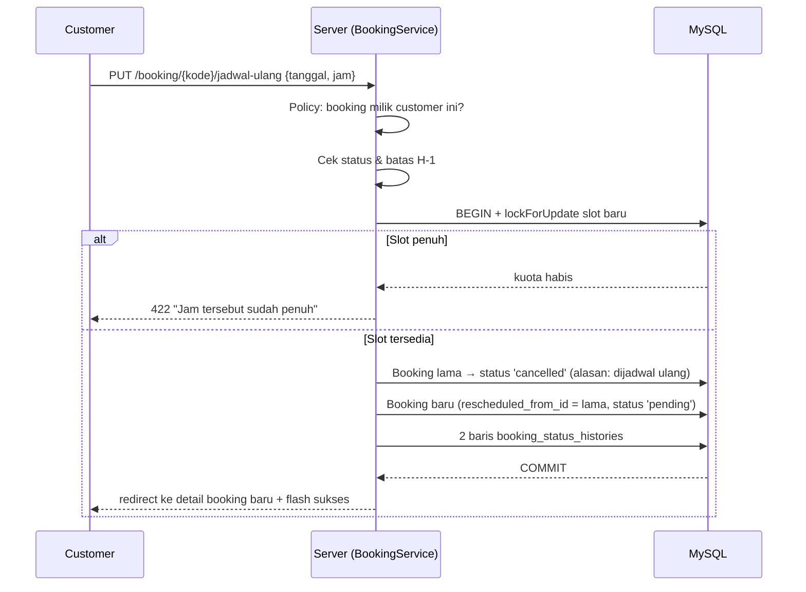
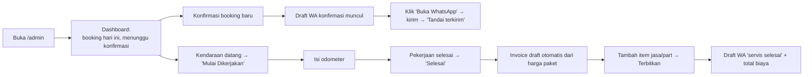

# 05 — Alur Bisnis

## 5.1 Aturan Slot Booking

Keputusan #7: **aturan sistem lama dipertahankan persis**. Bedanya, aturan tidak lagi tersebar di
tiga tempat dalam HTML, melainkan berada di `config/booking.php` dan ditegakkan di server.

| Aturan | Nilai | Dasar |
|--------|-------|-------|
| Slot tersedia | 08:00, 08:30, 09:00, 09:30, 10:00, 10:30, 11:00, 11:30, 13:00, 13:30, 14:00 | Sistem lama, baris 1633–1646 |
| Istirahat | 12:00–13:00 (tidak ada slot) | Tersirat dari daftar slot lama |
| Kuota per slot | **2 booking** | Sistem lama, baris 2318 |
| Waktu pesan tercepat | H+1 (besok) | Sistem lama, baris 2278–2282 |
| Hari tutup | Minggu | Sistem lama, baris 3130–3135 |
| Batas pemesanan terjauh | 60 hari ke depan | **Baru** — mencegah booking iseng jauh ke depan |
| Status awal | `pending` | **Baru** — dulu langsung `Successful` tanpa konfirmasi manusia |

### Cara kuota dihitung

```
sisa_kuota(tanggal, jam) = 2 − COUNT(bookings
                                     WHERE booking_date = tanggal
                                       AND booking_time = jam
                                       AND status NOT IN ('cancelled', 'no_show'))
```

Booking yang dibatalkan **melepaskan** kuotanya — perilaku ini tidak ada di sistem lama (di sana
seluruh booking dihitung, termasuk yang batal, sehingga slot bisa "penuh palsu").

### Perlindungan balapan (race condition)

Sistem lama membaca jumlah booking lalu menulis tanpa penguncian; dua orang yang menekan tombol
bersamaan bisa membuat slot terisi 3. Sistem baru membungkusnya dalam transaksi:

```php
DB::transaction(function () use ($data) {
    $count = Booking::where('booking_date', $data['date'])
        ->where('booking_time', $data['time'])
        ->whereNotIn('status', ['cancelled', 'no_show'])
        ->lockForUpdate()          // kunci baris sampai transaksi selesai
        ->count();

    if ($count >= config('booking.quota_per_slot')) {
        throw new SlotFullException($data['date'], $data['time']);
    }

    return Booking::create([...]);
});
```

### Catatan konflik jam Sabtu — ✅ diputuskan

Jam operasional Sabtu adalah **08:00–14:00**, sedangkan slot terakhir juga **14:00** — artinya
pekerjaan baru dimulai tepat saat bengkel tutup. Ini cacat yang terbawa dari sistem lama.

**Keputusan 3 Agustus 2026 ([R7](10-roadmap-implementasi.md#keputusan-yang-membentuk-roadmap-ini)):
slot Sabtu berhenti di 13:00.** Ini satu-satunya penyimpangan yang disengaja dari keputusan #7
(“aturan slot dipertahankan persis”), diambil karena alternatifnya adalah menjanjikan servis yang
tidak mungkin dikerjakan. Kuota 2/jam, aturan H-1, dan Minggu tutup **tidak** berubah.

```php
// config/booking.php
'slots_by_weekday' => [
    6 => ['08:00', '08:30', '09:00', '09:30', '10:00', '10:30', '11:00', '11:30', '13:00'],
],  // 6 = Sabtu — slot 13:30 & 14:00 ditutup
```

`SlotService` membaca kunci ini bila ada dan jatuh kembali ke `slots` untuk hari lain — tidak ada
percabangan hari yang ditulis di kode. Uji wajib: **booking Sabtu 13:30 ditolak**
([F1.4.10](10-roadmap-implementasi.md#tahap-5--booking-end-to-end-customer--f14----selesai)).

## 5.2 Alur Booking Customer



Perbedaan penting dari sistem lama: slot penuh **terlihat sebelum** pengguna memilih, bukan
ditolak lewat `alert()` setelah menekan submit.

## 5.3 State Machine Status Booking



### Tabel transisi yang sah

| Dari → Ke | Siapa | Syarat | Efek samping |
|-----------|-------|--------|--------------|
| — → `pending` | customer / advisor | lolos validasi slot | kode booking terbit, riwayat dicatat |
| `pending` → `confirmed` | advisor | — | `confirmed_at` diisi, draft WA "booking dikonfirmasi" disiapkan |
| `pending`/`confirmed` → `cancelled` | customer | status masih bisa dibatalkan **dan** tanggal booking ≥ besok | kuota slot dilepas, alasan wajib |
| `pending`/`confirmed` → `cancelled` | advisor | kapan pun, alasan wajib | sama, + draft WA "dibatalkan" |
| `confirmed` → `in_progress` | advisor | tanggal booking = hari ini (peringatan bila tidak) | `started_at` diisi, `estimated_finish_at` dihitung |
| `confirmed` → `no_show` | advisor | tanggal booking sudah lewat | kuota dilepas |
| `in_progress` → `completed` | advisor | — | `completed_at` diisi, odometer kendaraan diperbarui, invoice draft dibuat, draft WA "selesai" disiapkan |
| lainnya | — | **ditolak** oleh `BookingStatusController` | |

Setiap transisi menulis satu baris `booking_status_histories` berisi status asal, status tujuan,
pelaku, dan catatan. Transisi tidak sah menghasilkan HTTP 422 — bukan sekadar disembunyikan di UI.

## 5.4 Reschedule & Pembatalan Mandiri

**Syarat reschedule (US-C6):** status `pending` atau `confirmed`, dan
`booking_date ≥ hari ini + config('booking.reschedule_min_days_before')`.



Alasan booking baru dibuat alih-alih mengubah tanggal booking lama: riwayat jadwal tetap terlihat,
dan advisor bisa mengetahui pelanggan yang sering menggeser jadwal.

**Pembatalan:** menampilkan pilihan alasan (Berubah rencana · Sudah servis di tempat lain ·
Salah pilih jadwal · Lainnya) + isian bebas. Alasan tersimpan di `cancel_reason` dan ikut ke
riwayat status.

## 5.5 Alur Kerja Harian Service Advisor



## 5.6 Alur Estimasi Biaya & Invoice

| Tahap | Yang terjadi | Terlihat customer? |
|-------|--------------|--------------------|
| Saat booking | Estimasi = `service_packages.price` (atau "Gratis") ditampilkan di form | Ya |
| Status `completed` | `InvoiceService` membuat invoice `draft` berisi 1 item jasa dari paket | Tidak |
| Advisor menyunting | Menambah item jasa/part, diskon; subtotal & total dihitung server | Tidak |
| Advisor menerbitkan | Status `issued`, `invoice_number` terbit, `issued_at` diisi | Ya |
| Pembayaran dicatat | Status `paid` + metode pembayaran | Ya |

Aturan: nilai total **tidak pernah** dikirim dari browser; server menghitung ulang
`subtotal = Σ(qty × unit_price)` lalu `total = subtotal − discount + tax`. Invoice yang sudah
`issued` tidak dapat disunting — hanya bisa di-`void` lalu dibuat ulang, dan keduanya tercatat di
activity log.

Nomor invoice: `INV/{tahun}/{bulan}/{urut 4 digit per bulan}`, dibuat dalam transaksi dengan
penguncian agar tidak kembar.

## 5.7 Alur Pelacakan Publik (tanpa login)

Fitur "Cek Service" lama membiarkan siapa pun mengambil seluruh basis data lalu menyaringnya di
browser (temuan S8). Penggantinya:

- Pencarian memakai **kode booking** (`CA-20260803-0001`), bukan plat nomor.
- Hasil hanya menampilkan: kode, tanggal, jam, status, dan estimasi selesai — **tanpa** nama,
  nomor telepon, atau keluhan.
- Dibatasi 10 permintaan per menit per IP.
- Ada ajakan: "Login untuk melihat rincian lengkap dan riwayat servis Anda."

## 5.8 Aturan Validasi (ditegakkan di server)

| Field | Aturan |
|-------|--------|
| `plate_prefix` | wajib, 1–2 huruf A–Z (**memperbaiki** temuan B1) |
| `plate_number` | wajib, 1–4 angka |
| `plate_suffix` | wajib, 1–3 huruf A–Z |
| `phone_wa` | wajib, cocok `^(\+62\|62\|0)8[0-9]{7,12}$`, disimpan ternormalisasi `62…` |
| `booking_date` | wajib, format tanggal, `≥ hari ini + 1`, `≤ hari ini + 60`, bukan hari Minggu |
| `booking_time` | wajib, harus salah satu `config('booking.slots')`, kuota masih tersedia |
| `vehicle_id` | wajib, harus milik pengguna yang login (diperiksa Policy, bukan hanya `exists`) |
| `service_package_id` | wajib, paket harus `is_active` |
| `odometer` | opsional, integer 0–999999, tidak boleh lebih kecil dari `last_odometer` kendaraan |
| `complaint` | opsional, maks 1000 karakter |
| `cancel_reason` | wajib saat membatalkan, maks 255 karakter |

Semua pesan galat berbahasa Indonesia dan spesifik: *"Jam 09:00 pada 3 Agustus 2026 sudah penuh.
Tersisa: 10:30, 11:00, 13:00."* — bukan `alert('Slot penuh')`.

## 5.9 Perbandingan Ringkas dengan Sistem Lama

| Aspek | Lama | Baru |
|-------|------|------|
| Identitas pemesan | Diketik ulang tiap kali | Akun + kendaraan tersimpan |
| Status awal | `Successful` (langsung) | `pending` → butuh konfirmasi advisor |
| Slot penuh | Ditolak setelah submit | Terlihat sebelum memilih |
| Kuota saat batal | Tetap terhitung | Dilepas kembali |
| Validasi | Di browser (bisa dilewati) | Di server (+ mirror di browser untuk kenyamanan) |
| Jejak perubahan | Tidak ada | Riwayat status + activity log |
| Pelacakan publik | Seluruh data terekspos | Ringkasan status via kode booking |
| Biaya | Tidak ada | Estimasi + invoice + PDF |
