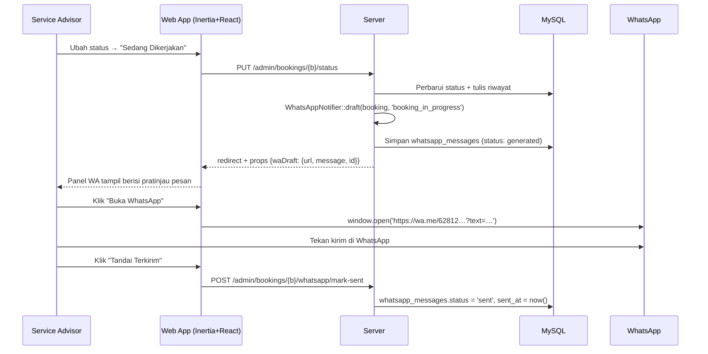

# 08 — Notifikasi WhatsApp

## 8.1 Keputusan & Batasannya

**Keputusan #6:** notifikasi WhatsApp dibuat **di sisi aplikasi sebagai draft klik-to-chat**,
dipicu ketika admin mengubah status booking. Tidak ada gateway berbayar.

| Konsekuensi | Penjelasan |
|-------------|------------|
| ✅ Biaya nol | Tidak ada langganan gateway, tidak ada tarif per pesan |
| ✅ Tanpa risiko blokir | Pesan dikirim dari WhatsApp milik bengkel sendiri, bukan API tidak resmi |
| ✅ Tanpa persetujuan Meta | Tidak perlu Business Manager atau template yang di-*approve* |
| ⚠️ Butuh satu klik manusia | Pesan **tidak** terkirim otomatis; advisor harus menekan kirim |
| ⚠️ Tidak ada bukti terkirim sungguhan | Sistem hanya mencatat "sudah ditandai terkirim", bukan *delivery receipt* |
| ⚠️ Tidak bisa dijadwalkan | Pengingat H-1 otomatis mustahil tanpa gateway (masuk daftar Won't do) |

Batasan-batasan ini konsekuensi langsung dari pilihan tanpa gateway — bukan kekurangan
implementasi. Jalur peningkatannya disiapkan di §8.7.

## 8.2 Cara Kerja



Pesan yang tampil di panel **bisa disunting** sebelum dikirim; versi final yang benar-benar dibuka
itulah yang tersimpan di `whatsapp_messages.rendered_message`.

## 8.3 Normalisasi Nomor

Sistem lama menyimpan nomor apa adanya, termasuk tanda hubung hasil format otomatis
(`0812-3456-7890`) — format itu tidak bisa dipakai `wa.me`. Aturan baru:

```php
final class PhoneNumber
{
    /** 0812-3456-7890 → 6281234567890 ; +62 812 3456 7890 → 6281234567890 */
    public static function normalize(string $raw): string
    {
        $digits = preg_replace('/\D+/', '', $raw);

        return match (true) {
            str_starts_with($digits, '62')  => $digits,
            str_starts_with($digits, '0')   => '62' . substr($digits, 1),
            str_starts_with($digits, '8')   => '62' . $digits,
            default                          => $digits,
        };
    }

    /** 6281234567890 → 0812-3456-7890 (untuk tampilan) */
    public static function forDisplay(string $normalized): string { /* … */ }
}
```

- Disimpan di database **selalu** dalam bentuk ternormalisasi (`users.phone_wa`).
- Ditampilkan di UI dalam format lokal yang enak dibaca.
- Validasi: `^62(8[1-9])[0-9]{6,11}$` setelah normalisasi.

## 8.4 Template Pesan

Disimpan di tabel `whatsapp_templates`, dapat disunting Super Admin tanpa menyentuh kode.

| Kunci | Pemicu | Isi awal (seeder) |
|-------|--------|-------------------|
| `booking_created` | Booking masuk (opsional, dikirim manual) | Halo {{nama}}, booking servis Anda dengan kode *{{kode_booking}}* sudah kami terima untuk {{tanggal}} pukul {{jam}}. Kami akan segera mengonfirmasi. — Chery Arta |
| `booking_confirmed` | Status → Dikonfirmasi | Halo {{nama}}, booking *{{kode_booking}}* untuk {{kendaraan}} ({{plat}}) **dikonfirmasi** pada {{tanggal}} pukul {{jam}}. Layanan: {{paket}}. Mohon datang 10 menit lebih awal. Alamat: {{alamat}}. — Chery Arta |
| `booking_in_progress` | Status → Sedang Dikerjakan | Halo {{nama}}, kendaraan {{kendaraan}} ({{plat}}) sedang kami kerjakan. Estimasi selesai pukul {{estimasi_selesai}}. Kode: {{kode_booking}}. — Chery Arta |
| `booking_completed` | Status → Selesai | Halo {{nama}}, servis kendaraan {{kendaraan}} ({{plat}}) telah **selesai** dan siap diambil. {{ringkasan_biaya}} Terima kasih telah mempercayakan perawatan pada Chery Arta. |
| `booking_cancelled` | Status → Dibatalkan | Halo {{nama}}, booking *{{kode_booking}}* pada {{tanggal}} pukul {{jam}} telah dibatalkan. Alasan: {{alasan}}. Silakan booking ulang kapan saja. — Chery Arta |
| `booking_reminder` | Dikirim manual H-1 | Halo {{nama}}, pengingat servis besok {{tanggal}} pukul {{jam}} untuk {{kendaraan}} ({{plat}}). Kode: {{kode_booking}}. Sampai jumpa! — Chery Arta |

### Placeholder yang tersedia

| Placeholder | Isi |
|-------------|-----|
| `{{nama}}` | `users.name` |
| `{{kode_booking}}` | `bookings.booking_code` |
| `{{tanggal}}` | Format Indonesia: "Senin, 3 Agustus 2026" |
| `{{jam}}` | "09:00" |
| `{{kendaraan}}` | Nama model (katalog atau manual) |
| `{{plat}}` | `vehicles.plate_full` |
| `{{paket}}` | `service_packages.name` |
| `{{estimasi_selesai}}` | Dihitung dari durasi paket |
| `{{ringkasan_biaya}}` | "Total biaya: Rp 450.000." atau string kosong bila gratis |
| `{{alasan}}` | `bookings.cancel_reason` |
| `{{alamat}}` | `config('company.address')` |

Penyunting template menampilkan daftar placeholder yang sah; placeholder tak dikenal ditolak saat
menyimpan agar tidak muncul `{{typo}}` di pesan pelanggan.

## 8.5 Pembuatan Tautan

```php
final class ClickToChatNotifier implements WhatsAppNotifier
{
    public function draft(Booking $booking, string $templateKey): WhatsAppDraft
    {
        $template = WhatsAppTemplate::active()->firstWhere('key', $templateKey);
        $message  = $this->render($template->body, $booking);   // ganti placeholder
        $phone    = $booking->user->phone_wa;                    // sudah ternormalisasi

        $log = WhatsAppMessage::create([
            'booking_id'       => $booking->id,
            'template_key'     => $templateKey,
            'recipient_phone'  => $phone,
            'rendered_message' => $message,
            'generated_by'     => auth()->id(),
            'status'           => 'generated',
        ]);

        return new WhatsAppDraft(
            id:      $log->id,
            url:     'https://wa.me/' . $phone . '?text=' . rawurlencode($message),
            message: $message,
        );
    }
}
```

Catatan teknis:
- `rawurlencode` — bukan `urlencode` — agar spasi menjadi `%20`, bukan `+`.
- Format tebal WhatsApp memakai `*teks*`; hindari karakter yang merusak URL.
- Panjang pesan dijaga ≤ 1.000 karakter agar aman di semua peramban.
- Tautan dibuka lewat `window.open(url, '_blank', 'noopener')`.

## 8.6 Tombol WhatsApp di Landing Page

Terpisah dari alur di atas: tombol mengambang di seluruh halaman publik yang mengarah ke nomor
resmi bengkel (`config('company.wa_number')`) dengan pesan awal terisi:

```
https://wa.me/{COMPANY_WA_NUMBER}?text=Halo%20Chery%20Arta%2C%20saya%20ingin%20bertanya%20tentang%20layanan%20servis.
```

Pada halaman detail katalog, pesan awalnya menyebut model yang sedang dilihat — meningkatkan
peluang percakapan berlanjut.

## 8.7 Jalur Peningkatan ke Gateway Otomatis

Kode memanggil **interface**, bukan implementasi:

```php
interface WhatsAppNotifier
{
    public function draft(Booking $booking, string $templateKey): WhatsAppDraft;
    public function send(Booking $booking, string $templateKey): void;   // no-op di klik-to-chat
}
```

`ClickToChatNotifier` membiarkan `send()` tidak melakukan apa-apa. Bila kelak diputuskan memakai
gateway (Fonnte / WhatsApp Cloud API), cukup:

1. Tambah `FonnteNotifier implements WhatsAppNotifier` dengan `send()` yang benar-benar mengirim.
2. Ubah pengikatan di `AppServiceProvider` berdasarkan `config('whatsapp.driver')`.
3. Bungkus `send()` dalam Job antrean agar tidak memperlambat request.

Tidak ada controller, template, atau tabel yang perlu diubah. Pengingat H-1 otomatis baru menjadi
mungkin pada titik itu.

## 8.8 Aturan Privasi

- Nomor WhatsApp pelanggan **tidak pernah** tampil di halaman publik.
- Pesan hanya boleh dibuat oleh staf yang login, dan hanya untuk booking yang ia akses secara sah.
- `whatsapp_messages` menyimpan isi pesan untuk keperluan audit — bukan untuk pemasaran.
- Dilarang mengirim promosi lewat mekanisme ini; template hanya untuk pesan transaksional.
