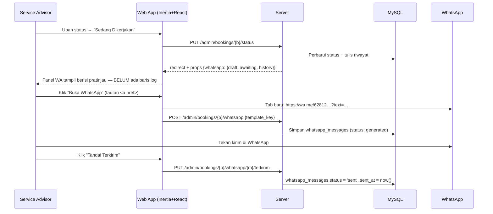

# 08 — Notifikasi WhatsApp

## 8.1 Keputusan & Batasannya

**Keputusan #6:** notifikasi WhatsApp dibuat **di sisi aplikasi sebagai draft klik-to-chat**,
dipicu ketika admin mengubah status booking. Tidak ada gateway berbayar.

| Konsekuensi | Penjelasan |
|-------------|------------|
| ✅ Biaya nol | Tidak ada langganan gateway, tidak ada tarif per pesan |
| ✅ Tanpa risiko blokir | Pesan dikirim dari WhatsApp milik bengkel sendiri, bukan API tidak resmi |
| ✅ Tanpa persetujuan Meta | Tidak perlu Business Manager atau template yang di-*approve* |
| ⚠️ Butuh satu klik manusia | Pesan **tidak** terkirim otomatis; advisor harus menekan kirim |
| ⚠️ Tidak ada bukti terkirim sungguhan | Sistem hanya mencatat "sudah ditandai terkirim", bukan *delivery receipt* |
| ⚠️ Tidak bisa dijadwalkan | Pengingat H-1 otomatis mustahil tanpa gateway (masuk daftar Won't do) |

Batasan-batasan ini konsekuensi langsung dari pilihan tanpa gateway — bukan kekurangan
implementasi. Jalur peningkatannya disiapkan di §8.7.

## 8.2 Cara Kerja



**Baris log lahir saat tombol ditekan, bukan saat status berubah.** Kalau ia ditulis otomatis pada
setiap perubahan status, aksi cepat dashboard (Konfirmasi · Mulai · Selesai) meninggalkan tiga
baris per booking, dan kartu "Belum dikabari" di [§A1](07-modul-admin.md) tidak akan pernah bisa
dikosongkan. Konsekuensinya diterima sadar: advisor yang mengubah status lalu menutup tab tidak
meninggalkan jejak — itulah sebabnya kartu dashboard menghitung dari sisi **booking**, bukan dari
sisi baris draft.

**Tombolnya `<a href>` sungguhan, bukan `window.open()` sesudah menunggu respons.** Peramban
memblokir jendela baru yang dibuka di luar tumpukan gestur pengguna, jadi pola "POST dulu, buka
belakangan" gagal diam-diam di sebagian pemakaian. Penekanan yang sama memicu POST pencatatnya.

**Pesan di panel TIDAK bisa disunting.** Tautan `wa.me` tidak mengirim apa pun — ia mengisi kolom
ketik WhatsApp, dan di sanalah advisor menambah kalimat bila perlu. Penyunting kedua di panel kita
hanya menggandakan kemampuan itu, sekaligus menukar `rendered_message` dari "teks resmi yang
server keluarkan" menjadi "teks yang diklaim klien" — yang tidak bisa diverifikasi. Permintaan
pencatatnya karena itu hanya membawa `template_key`; isinya disusun ulang di server.

## 8.3 Normalisasi Nomor

Sistem lama menyimpan nomor apa adanya, termasuk tanda hubung hasil format otomatis
(`0812-3456-7890`) — format itu tidak bisa dipakai `wa.me`. Aturan baru:

```php
final class PhoneNumber
{
    /** 0812-3456-7890 → 6281234567890 ; +62 812 3456 7890 → 6281234567890 */
    public static function normalize(string $raw): string
    {
        $digits = preg_replace('/\D+/', '', $raw);

        return match (true) {
            str_starts_with($digits, '62')  => $digits,
            str_starts_with($digits, '0')   => '62' . substr($digits, 1),
            str_starts_with($digits, '8')   => '62' . $digits,
            default                          => $digits,
        };
    }

    /** 6281234567890 → 0812-3456-7890 (untuk tampilan) */
    public static function forDisplay(string $normalized): string { /* … */ }
}
```

- Disimpan di database **selalu** dalam bentuk ternormalisasi (`users.phone_wa`).
- Ditampilkan di UI dalam format lokal yang enak dibaca.
- Validasi: `^62(8[1-9])[0-9]{6,11}$` setelah normalisasi.

## 8.4 Template Pesan

Disimpan di tabel `whatsapp_templates`, dapat disunting Super Admin tanpa menyentuh kode.

| Kunci | Pemicu | Isi awal (seeder) |
|-------|--------|-------------------|
| `booking_created` | Booking masuk (opsional, dikirim manual) | Halo {{nama}}, booking servis Anda dengan kode *{{kode_booking}}* sudah kami terima untuk {{tanggal}} pukul {{jam}}. Kami akan segera mengonfirmasi. — Chery Arta |
| `booking_confirmed` | Status → Dikonfirmasi | Halo {{nama}}, booking *{{kode_booking}}* untuk {{kendaraan}} ({{plat}}) **dikonfirmasi** pada {{tanggal}} pukul {{jam}}. Layanan: {{paket}}. Mohon datang 10 menit lebih awal. Alamat: {{alamat}}. — Chery Arta |
| `booking_in_progress` | Status → Sedang Dikerjakan | Halo {{nama}}, kendaraan {{kendaraan}} ({{plat}}) sedang kami kerjakan. Estimasi selesai pukul {{estimasi_selesai}}. Kode: {{kode_booking}}. — Chery Arta |
| `booking_completed` | Status → Selesai | Halo {{nama}}, servis kendaraan {{kendaraan}} ({{plat}}) telah **selesai** dan siap diambil. {{ringkasan_biaya}} Terima kasih telah mempercayakan perawatan pada Chery Arta. |
| `booking_cancelled` | Status → Dibatalkan | Halo {{nama}}, booking *{{kode_booking}}* pada {{tanggal}} pukul {{jam}} telah dibatalkan. Alasan: {{alasan}}. Silakan booking ulang kapan saja. — Chery Arta |
| `booking_no_show` | Status → Tidak Hadir | Halo {{nama}}, kami menunggu kendaraan {{kendaraan}} ({{plat}}) pada {{tanggal}} pukul {{jam}} namun belum sempat bertemu. Kode: {{kode_booking}}. Silakan hubungi kami untuk menjadwalkan ulang. - Chery Arta |
| `booking_reminder` | Dikirim manual H-1 | Halo {{nama}}, pengingat servis besok {{tanggal}} pukul {{jam}} untuk {{kendaraan}} ({{plat}}). Kode: {{kode_booking}}. Sampai jumpa! - Chery Arta |

Tujuh kunci, ditetapkan `App\Enums\WhatsAppTemplateKey`. `booking_no_show` ada karena ia
satu-satunya akhir yang punya jalur pemulihan: slotnya sudah hangus, jadi tidak ada ruginya
mengundang pelanggan kembali.

Dua di antaranya **sukarela** dan tidak ikut dihitung sebagai tunggakan di dashboard:
`booking_created` (booking yang belum dikonfirmasi belum menjanjikan apa pun) dan
`booking_reminder` (tidak terikat perubahan status mana pun).

### Placeholder yang tersedia

Daftar yang berlaku ada di **`config('whatsapp.allowed_placeholders')`** — itu sumber kebenaran
untuk validasi, dan `App\Support\WhatsAppPlaceholders` sumber kebenaran untuk perenderan.
`tests/Unit/WhatsAppPlaceholderTest.php` memastikan keduanya identik. Dokumen ini sengaja tidak
menyalin daftarnya lagi: ketiga salinan pernah nyata berselisih, dan selisih semacam itu hanya
ketahuan dari pesan pelanggan yang berisi `{{typo}}`.

Isinya, ringkasnya: `nama` · `kode_booking` · `tanggal` (format "Senin, 3 Agustus 2026") · `jam` ·
`kendaraan` · `plat` · `paket` · `estimasi_selesai` · `alasan` · `alamat`.

> **`{{ringkasan_biaya}}` belum ada.** Sumbernya tabel `invoices` yang baru lahir di Tahap 11.
> Ia sengaja **ditolak** validasi alih-alih dirender kosong: placeholder yang sah tetapi selalu
> kosong membuat Super Admin menyangka penyuntingnya rusak, sedangkan penolakan menjelaskan.
>
> **`{{status}}` tidak diadakan.** Setiap template sudah terikat satu pemicu, jadi ia selalu
> berbunyi hal yang sama — dan menyesatkan bila disisipkan ke pengingat.

Penyunting template menampilkan daftar placeholder yang sah beserta pratinjau terender memakai
data contoh; placeholder tak dikenal ditolak saat menyimpan, dengan pesan yang **menyebut nama**
yang salah.

Panjang badan template dibatasi `config('whatsapp.max_template_body_length')` — lebih pendek
daripada batas pesan, karena placeholder mengembang saat dirender dan pesan yang melewati batas
dipotong diam-diam sehingga penutupnya hilang.

## 8.5 Pembuatan Tautan

```php
final class ClickToChatNotifier implements WhatsAppNotifier
{
    /** Operasi BACA MURNI — tidak menyentuh database sama sekali. */
    public function draft(Booking $booking, WhatsAppTemplateKey $templateKey): ?WhatsAppDraft
    {
        $phone = $booking->user->phone_wa;

        if ($phone === null || $phone === '') {
            return null;                      // pelanggan tanpa nomor
        }

        $template = $this->template($templateKey);   // active()->where('key', …)

        if ($template === null) {
            return null;                      // dinonaktifkan Super Admin
        }

        $message = WhatsAppLink::truncate(
            WhatsAppPlaceholders::render($template->body, WhatsAppPlaceholders::forBooking($booking)),
        );

        return new WhatsAppDraft(
            templateKey:  $templateKey,
            url:          WhatsAppLink::to($phone, $message),
            message:      $message,
            phone:        $phone,
            phoneDisplay: PhoneNumber::forDisplay($phone),
        );
    }
}
```

Pencatatannya milik `WhatsAppMessageService` dan terjadi terpisah, ketika tombolnya benar-benar
ditekan. Pemisahan itu juga berarti implementasi gateway kelak cukup memanggil service yang sama
alih-alih menyalin ulang pencatatannya.

`null` **bukan kegagalan** — ia jawaban yang sah untuk dua keadaan wajar. Tidak ada jalur cadangan
diam-diam ke teks bawaan bila template dinonaktifkan: cadangan semacam itu membuat tombol
"nonaktifkan" tidak melakukan apa-apa, dan itu lebih membingungkan daripada panel yang menjelaskan
keadaannya.

Catatan teknis:
- `rawurlencode` — bukan `urlencode` — agar spasi menjadi `%20`, bukan `+`.
- Format tebal WhatsApp memakai `*teks*`; hindari karakter yang merusak URL.
- Panjang pesan dijaga ≤ 1.000 karakter agar aman di semua peramban.
- Seluruh penyusunan URL lewat `App\Support\WhatsAppLink` — satu pintu, sehingga tidak ada jalur
  kedua yang bisa melewatkan normalisasi nomor.
- Tautan dibuka lewat `<a href target="_blank" rel="noopener noreferrer">`, **bukan**
  `window.open()` sesudah menunggu respons: peramban memblokir jendela yang dibuka di luar
  tumpukan gestur pengguna.

## 8.6 Tombol WhatsApp di Landing Page

Terpisah dari alur di atas: tombol mengambang di seluruh halaman publik yang mengarah ke nomor
resmi bengkel (`config('company.wa_number')`) dengan pesan awal terisi:

```
https://wa.me/{COMPANY_WA_NUMBER}?text=Halo%20Chery%20Arta%2C%20saya%20ingin%20bertanya%20tentang%20layanan%20servis.
```

Pada halaman detail katalog, pesan awalnya menyebut model yang sedang dilihat — meningkatkan
peluang percakapan berlanjut.

## 8.7 Jalur Peningkatan ke Gateway Otomatis

Kode memanggil **interface**, bukan implementasi:

```php
interface WhatsAppNotifier
{
    public function draft(Booking $booking, WhatsAppTemplateKey $templateKey): ?WhatsAppDraft;
}
```

**Tidak ada `send()`.** Versi sebelumnya menuliskannya sebagai no-op pada klik-to-chat; itu kode
mati. Jaminan "cukup tambah implementasi baru" datang dari **adanya interface ini**, bukan dari
method yang tidak dipanggil siapa pun — dan karena tidak ada pemanggilnya hari ini, method kosong
itu tidak memaksa siapa pun menulis kode yang siap-gateway. Saat gateway benar-benar dipilih,
`send()` dirancang terhadap API yang nyata (kembaliannya, antreannya, penanganan gagalnya) alih-alih
ditebak sekarang.

Bila kelak diputuskan memakai gateway (Fonnte / WhatsApp Cloud API), cukup:

1. Tambah `FonnteNotifier implements WhatsAppNotifier` dengan `send()` yang benar-benar mengirim.
2. Ubah pengikatan di `AppServiceProvider` berdasarkan `config('whatsapp.driver')`.
3. Bungkus `send()` dalam Job antrean agar tidak memperlambat request.

Tidak ada controller, template, atau tabel yang perlu diubah. Pengingat H-1 otomatis baru menjadi
mungkin pada titik itu.

## 8.8 Aturan Privasi

- Nomor WhatsApp pelanggan **tidak pernah** tampil di halaman publik.
- Pesan hanya boleh dibuat oleh staf yang login, dan hanya untuk booking yang ia akses secara sah.
- `whatsapp_messages` menyimpan isi pesan untuk keperluan audit — bukan untuk pemasaran.
- Dilarang mengirim promosi lewat mekanisme ini; template hanya untuk pesan transaksional.
- **Tidak ada layar log global.** Riwayat dibaca dari detail booking dan dari daftar booking yang
  disaring `wa=belum`. Tabel berisi isi pesan + nomor pelanggan yang bisa ditelusuri bebas adalah
  permukaan privasi baru yang belum ada yang meminta.
- Barisnya **tidak pernah dihapus** dan tidak punya retensi — ia audit, dan tumbuhnya pelan karena
  satu baris hanya lahir per pesan yang benar-benar dibuka.
- Pratinjau di penyunting template memakai **data karangan**, bukan booking sungguhan: layar itu
  tidak punya alasan menampilkan nama, plat, dan jadwal pelanggan nyata.

### Batas kejujuran log

`rendered_message` adalah bukti **pesan apa yang dikeluarkan sistem** — bukan kalimat apa yang
sampai ke pelanggan. Advisor tetap bebas menyunting di kotak ketik WhatsApp sebelum menekan kirim,
dan suntingan itu memang tidak terekam. Begitu pula "Tandai Terkirim": ia pernyataan advisor, bukan
*delivery receipt* (§8.1). Batas ini ditulis apa adanya supaya log ini tidak dibaca sebagai arsip
percakapan.
